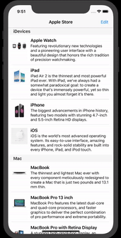
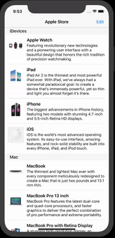

# AppleProducts

### List with Apple Products.

###### `UITableView` and `UITableViewController` are used in almost all iOS apps. I developed a photo browser app using Table View and Table View Controller.

### App Stracture:

+ Data Model Classes to display on `UITableView` & `UITableViewController`.
+ Basic `UITableView`, `UITableViewController` and `UItableViewCell`.
+ Custom Table View Cell, Dynamic Table View Cell Height and Self-Sizing Cell.
+ Multiple Sections in Table View.

---

---

+ Delete Rows from Table View.

---

---

+ Drag and Drop to move Cell in Table View.

---

---

+ Use show segue to transition from master to Detail View Controller.

---

